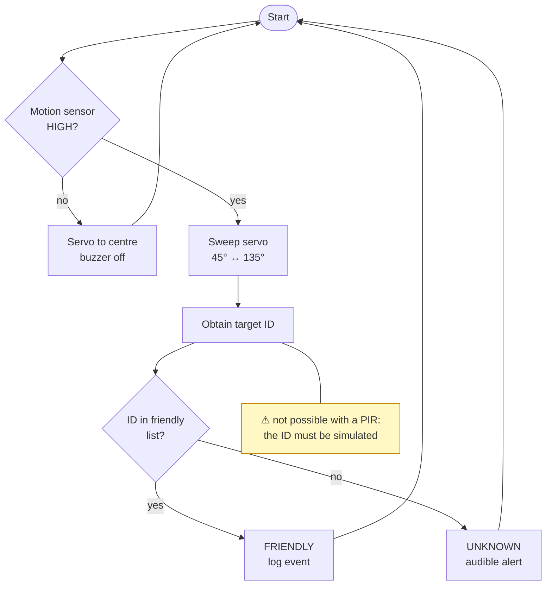
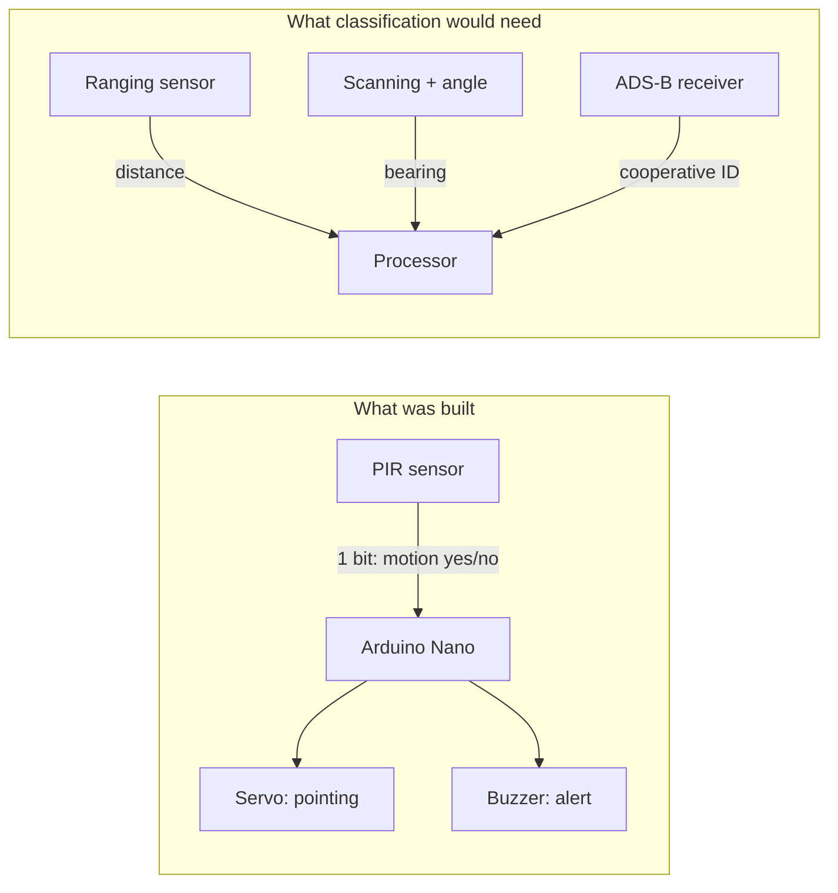
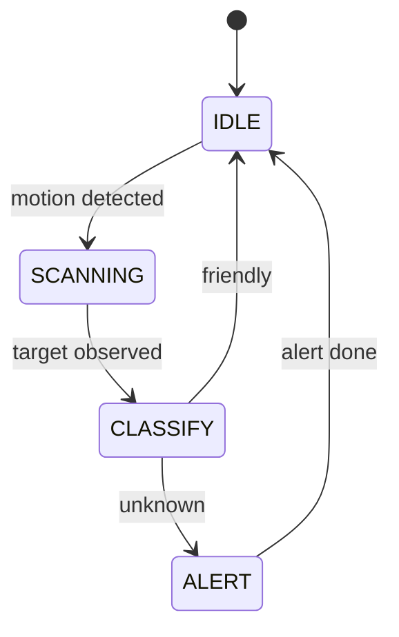

# Concept Diagrams

## Target classification flow

```mermaid
flowchart TD
    A([Start]) --> B{Motion sensor<br/>HIGH?}
    B -- no --> I[Servo to centre<br/>buzzer off] --> A
    B -- yes --> C[Sweep servo<br/>45° ↔ 135°]
    C --> D[Obtain target ID]
    D --> E{ID in friendly<br/>list?}
    E -- yes --> F[FRIENDLY<br/>log event]
    E -- no --> G[UNKNOWN<br/>audible alert]
    F --> A
    G --> A
    D --- W["⚠ not possible with a PIR:<br/>the ID must be simulated"]
    style W fill:#fff8c5,stroke:#bf8700
```

## Where each piece of information would come from

```mermaid
flowchart LR
    subgraph Built["What was built"]
        PIR[PIR sensor] -->|1 bit: motion yes/no| N[Arduino Nano]
        N --> SV[Servo: pointing]
        N --> BZ[Buzzer: alert]
    end
    subgraph Needed["What classification would need"]
        R[Ranging sensor] -->|distance| X[Processor]
        AN[Scanning + angle] -->|bearing| X
        ADS[ADS-B receiver] -->|cooperative ID| X
    end
```

## System states

```mermaid
stateDiagram-v2
    [*] --> IDLE
    IDLE --> SCANNING : motion detected
    SCANNING --> CLASSIFY : target observed
    CLASSIFY --> IDLE : friendly
    CLASSIFY --> ALERT : unknown
    ALERT --> IDLE : alert done
```
